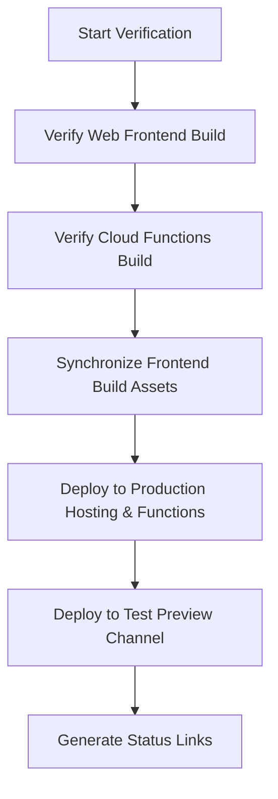

# Production Deployment & Verification Skill

This skill outlines the strict workflow for verifying and deploying updates to the DispatchBox system. It prevents outdated assets, broken imports, or uncompiled backend functions from hitting production.

## Workflow Overview



---

## Step 1: Verify & Build Web Frontend

Before deploying, you must compile the Vite/React web code to catch any Type errors:

```bash
cd x:\Antigravity\Projects\field-service-mgmt\frontend\web
npm run build
```

Verify that the output directory `frontend/web/dist` contains the updated assets.

---

## Step 2: Verify & Compile Cloud Functions

Since the backend runs on Node.js, the TypeScript files inside `firebase/functions/src` must be built into raw JavaScript before deploying:

```bash
cd x:\Antigravity\Projects\field-service-mgmt\firebase\functions
npm run build
```

This runs the TypeScript compiler (`tsc`) and populates the `firebase/functions/lib` folder which Firebase deploys. **Never skip this step**, or old compiled files will be pushed to the Cloud.

---

## Step 3: Synchronize Build Assets

The React build outputs to `frontend/web/dist`, but `firebase.json` serves static hosting from `firebase/public`. You must copy the assets into the Firebase public folder:

```powershell
Copy-Item -Path "x:\Antigravity\Projects\field-service-mgmt\frontend\web\dist\*" -Destination "x:\Antigravity\Projects\field-service-mgmt\firebase\public" -Recurse -Force
```

---

## Step 4: Deploy to Production (Live Site)

Deploy the synchronized static web assets and compiled Cloud Functions to the primary Firebase project environment:

```bash
cd x:\Antigravity\Projects\field-service-mgmt\firebase
npx firebase-tools deploy --only hosting,functions
```

Primary Live URL: `https://maintenancemanager-c5533.web.app`

---

## Step 5: Deploy to Test Environment (Preview Channel)

Deploy a secondary build to the Firebase `test` preview channel:

```bash
cd x:\Antigravity\Projects\field-service-mgmt\firebase
npx firebase-tools hosting:channel:deploy test
```

Save the temporary URL returned by the preview channel to provide to the user for testing and verification.
